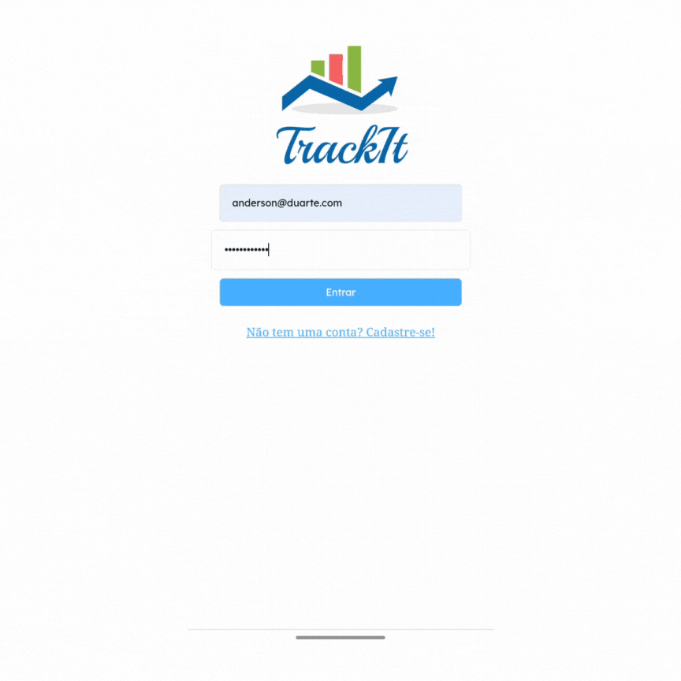

# Trackit

Este é um aplicativo web mobile construído com React, que possibilita aos seus usuários cadastrarem seus hábitos e os administrarem ao longo dos dias da semana.

Clique no link para testar: https://projeto11-trackit-git-main-01andersonduarte.vercel.app/

## Sobre:

A aplicação possui as seguintes funcionalidades:

<ul>
    <li>Realizar cadastro</li>
    <li>Realizar login</li>
    <li>Cadastro de hábitos</li>
    <li>Administração de hábitos</li>
</ul>

Implementações futuras para melhorias:

<ul>
    <li>Realizar logout</li>
    <li>Carregar histórico</li>
    <li>Alterar imagem</li>
</ul>

## Tecnologias utilizadas:

 
    
    
    
    

 